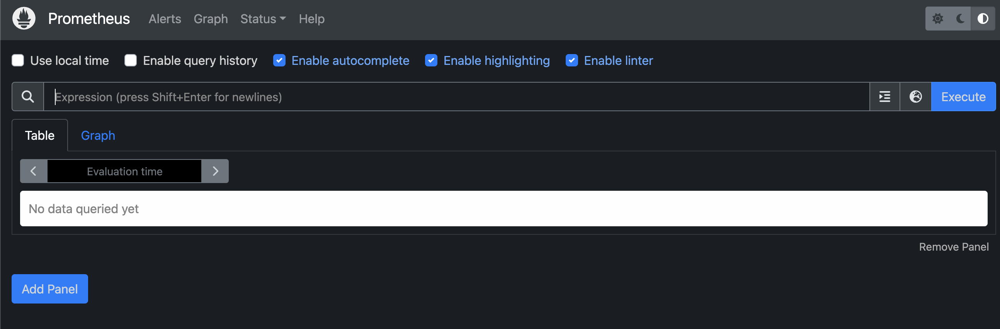
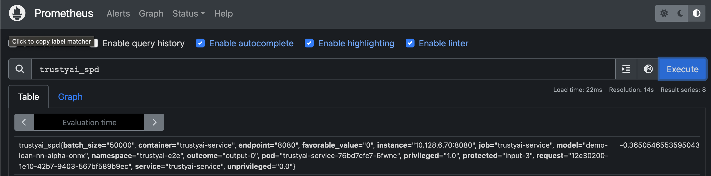
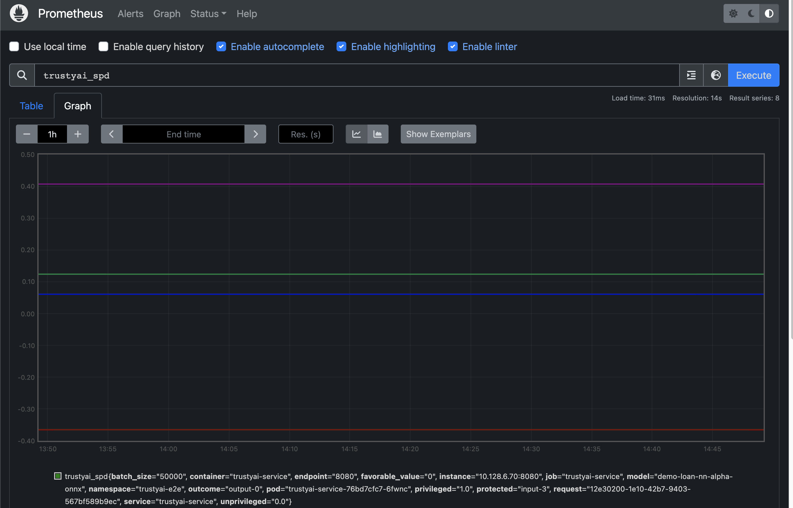

# E2E Tests
This script tests the current ODH-Manifests master integration of TrustyAI.

# Usage
1. Install the ODH operator onto your cluster
2. Make sure you logged into the oc CLI: `oc login ...` 
3. Run `./trustyai_test.sh`
4. At a certain point in the script, it will say:
```
Ensure metrics are in Prometheus
Please check that trustyai_spd data exists at the following endpoint:
[URL]
```
You'll need to click on that url, which will open the cluster login page. Once logged in, you'll see the Prometheus UI:


Enter `trustyai_spd` into the "Expression" field and hit `Execute`. You (should) then see the query result:





Hit the `Graph` tab and make sure there is data populated there:



If those steps proceeded without issue, return to the terminal and hit enter.

4. The script will finish and clean up the cluster.