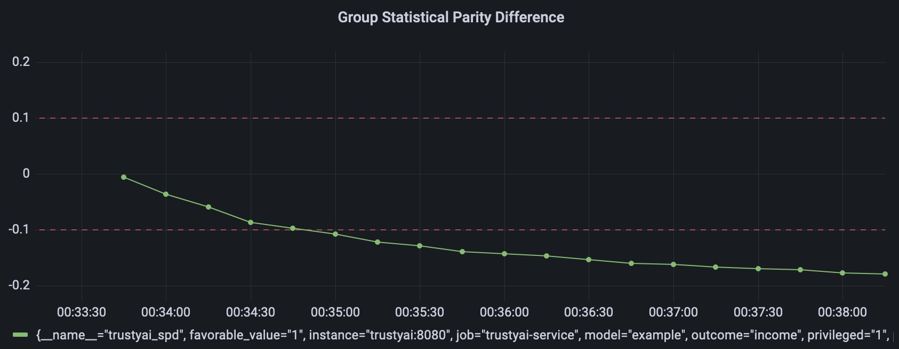

# trustyai-service

<!-- TOC -->

* [trustyai-service](#trustyai-service)
* [Running](#running)
    * [Locally](#locally)
        * [Using data in storage only](#using-data-in-storage-only)
            * [Own data in MinIO](#own-data-in-minio)
        * [Consuming KServe v2 data](#consuming-kserve-v2-data)
    * [S3 (MinIO)](#s3--minio-)
* [Endpoints](#endpoints)
    * [Metrics](#metrics)
        * [Statistical Parity Difference](#statistical-parity-difference)
        * [Disparate Impact Ratio](#disparate-impact-ratio)
        * [Scheduled metrics](#scheduled-metrics)
    * [Metric Definitions](#metric-definitions)
    * [Prometheus](#prometheus)
    * [Health checks](#health-checks)
    * [Consuming KServe v2 payloads](#consuming-kserve-v2-payloads)
* [Data sources](#data-sources)
    * [Metrics](#metrics-1)
* [Deployment](#deployment)
    * [OpenShift](#openshift)

<!-- TOC -->

# Running

## Locally

The TrustyAI service includes several demos.

- generating data into storage, which can be monitored by the service
- or, having a process simulating sending KServe gRPC data to a consumer endpoint

With either of these demos, the TrustyAI service will monitor the payloads and produce fairness metrics.

The first step to run the demos locally, is to build the TrustyAI service container image.
This can be done by running (on `$PROJECT/explainability-service`):

```shell
mvn clean install -Dquarkus.container-image.build=true
```

### Using data in storage only

To run this demo, first build the remaining images using:

```shell
$ cd demo
$ docker compose -f compose-generator-memory-single-model.yaml build
```

Finally, run the demo using:

```shell
$ docker compose -f compose-generator-memory-single-model.yaml up
```

Issue a metric request to, for instance:

```shell
curl -X POST --location "http://localhost:8080/metrics/spd/request" \
    -H "Content-Type: application/json" \
    -d "{
            \"modelId\": \"example-1\",
            \"protectedAttribute\": \"input-2\",
            \"favorableOutcome\": {
                \"type\": \"DOUBLE\",
                \"value\": 1.0
            },
            \"outcomeName\": \"output-0\",
            \"privilegedAttribute\": {
                \"type\": \"DOUBLE\",
                \"value\": 1.0
            },
            \"unprivilegedAttribute\": {
                \"type\": \"DOUBLE\",
                \"value\": 0.0
            } 
        }"
```

And observe the `trustyai_spd` metric in Prometheus: http://localhost:9090

#### Own data in MinIO

To use your own provided data, configure the MinIO container (by pre-populating it with data, according to
the [steps below](#s3-minio))
and run the container using (either `docker`, `podman`):

```shell
docker run -p 8080:8080 \
    --env SERVICE_DATA_FORMAT=CSV \
    --env SERVICE_STORAGE_FORMAT="MINIO" \
    --env MINIO_BUCKET_NAME="inputs" \
    --env MINIO_ENDPOINT="http://localhost:9000" \
    --env STORAGE_DATA_FILENAME="income-biased-inputs.csv" \
    --env STORAGE_DATA_FOLDER="/inputs" \
    --env MINIO_SECRET_KEY="minioadmin" \
    --env MINIO_ACCESS_KEY="minioadmin" \
    --env SERVICE_METRICS_SCHEDULE="5s" \
    trustyai/trustyai-service:999-SNAPSHOT -d 
```

When using the metrics HTTP request, remember to adjust the feature names and values to what makes sense for your own
data.

### Consuming KServe v2 data

Another demo includes a process with simulates sending gRPC encoded KServe v2 data to a `consumer` endpoint in the
service.
The service then parses the data and saves it into storage.

To run it, start by building the necessary images with:

```shell
$ cd demo
$ docker compose -f compose-generator-pvc-multi-model.yaml build
```

This demo uses a Docker bind mount, which on the host can be created with:

```shell
mkdir -p ~/volumes/pvc/inputs
```

> Note:
>
> If you are having permission errors from the service, while saving the data to the volume, change the permissions
> with `cmhod 777 ~/volume/pvc/inputs`

The demo can then be started with:

```shell
docker compose -f compose-generator-pvc-multi-model.yaml.yml up
```

After a few seconds, you will start seeing the logs showing both the payload sent

```text
generator         | Sending data
trustyai-service  | 2023-02-18 12:22:13,572 INFO  [org.kie.tru.ser.end.con.ConsumerEndpoint] (executor-thread-1) Got payload on the consumer
trustyai-service  | 2023-02-18 12:22:13,572 INFO  [org.kie.tru.ser.end.con.ConsumerEndpoint] (executor-thread-1) [Feature{name='input-0', type=number, value=22.0}, Feature{name='input-1', type=number, value=5.0}, Feature{name='input-2', type=number, value=1.0}]
trustyai-service  | 2023-02-18 12:22:13,572 INFO  [org.kie.tru.ser.end.con.ConsumerEndpoint] (executor-thread-1) [Output{value=1.0, type=number, score=1.0, name='output-0'}]
trustyai-service  | 2023-02-18 12:22:18,001 INFO  [org.kie.tru.ser.dat.par.CSVParser] (executor-thread-1) Creating dataframe from CSV data
trustyai-service  | 2023-02-18 12:22:18,001 INFO  [org.kie.tru.ser.dat.DataSource] (executor-thread-1) Batching with 5000 rows. Passing 73 rows
```

You can also inspect the data `~/volumes/pvc/inputs` in order to see what data is being serialised.

## S3 (MinIO)

In order to set up MinIO for local development, first install the [MinIO client](https://github.com/minio/mc) `mc`.
Run the MinIO server with

```shell
docker run \
   -p 9000:9000 \
   -p 9090:9090 \
   --name minio \
   -v ~/minio/trustyai-service/data:/data \
   -e "MINIO_ROOT_USER=minioadmin" \
   -e "MINIO_ROOT_PASSWORD=minioadmin" \
   quay.io/minio/minio server /data --console-address ":9090"
```

Connect to MinIO using:

```shell
mc alias set local http://127.0.0.1:9000 minioadmin minioadmin
```

Now create a bucket, for instance, `inputs`:

```shell
mc mb local/inputs
```

Copy a file into the bucket:

```shell
mc cp data/income-biased-inputs.csv local/inputs
```

Optionally, check the file was successfully copies:

```shell
mc ls local/inputs
```

Which should produce:

```text
[2023-02-09 23:01:49 GMT]  68KiB income-biased-inputs.csv
```

# Endpoints

The OpenAPI schema can be displayed using

```shell
curl -X GET --location "http://localhost:8080/q/openapi"
```

## Metrics

Each of the metrics default bounds can be overridden with
the corresponding environment variable, e.g.

- `METRICS_SPD_THRESHOLD_LOWER`
- `METRICS_SPD_THRESHOLD_UPPER`
- `METRICS_DIR_THRESHOLD_LOWER`
- _etc_

### Statistical Parity Difference

Get statistical parity difference at `/metrics/spd`

```shell
curl -X POST --location "http://{{host}}/metrics/spd" \
    -H "Content-Type: application/json" \
    -d "{
          \"modelId\": \"example-model-1\",
          \"protectedAttribute\": \"input-2\",
          \"favorableOutcome\": {
            \"type\": \"DOUBLE\",
            \"value\": 1.0
          },
          \"outcomeName\": \"output-0\",
          \"privilegedAttribute\": {
            \"type\": \"DOUBLE\",
            \"value\": 1.0
          },
          \"unprivilegedAttribute\": {
            \"type\": \"DOUBLE\",
            \"value\": 0.0
          }
        }"
```

Returns:

```http request
HTTP/1.1 200 OK
content-length: 199
Content-Type: application/json;charset=UTF-8

{
  "type": "metric",
  "name": "SPD",
  "value": -0.2531969309462916,
  "specificDefinition":"The SPD of -0.253196 indicates that the likelihood of Group:gender=1 receiving Outcome:income=1 was -25.3196 percentage points lower than that of Group:gender=0."
  "timestamp": 1675850601910,
  "thresholds": {
    "lowerBound": -0.1,
    "upperBound": 0.1,
    "outsideBounds": true
  },
  "id": "ec435fc6-d037-493b-9efc-4931138d7656"
}
```

### Disparate Impact Ratio

```shell
curl -X POST --location "http://{{host}}/metrics/dir" \
    -H "Content-Type: application/json" \
    -d "{
          \"modelId\": \"example-model-1\",
          \"protectedAttribute\": \"input-2\",
          \"favorableOutcome\": {
            \"type\": \"DOUBLE\",
            \"value\": 1.0
          },
          \"outcomeName\": \"output-0\",
          \"privilegedAttribute\": {
            \"type\": \"DOUBLE\",
            \"value\": 1.0
          },
          \"unprivilegedAttribute\": {
            \"type\": \"DOUBLE\",
            \"value\": 0.0
          }
        }"
```

```http request
HTTP/1.1 200 OK
content-length: 197
Content-Type: application/json;charset=UTF-8
{
  "type": "metric",
  "name": "DIR",
  "value": 0.3333333333333333,
  "specificDefinition":"The DIR of 0.33333 indicates that the likelihood of Group:gender=1 receiving Outcome:income=1 is 0.33333 times that of Group:gender=0."
  "id": "15f87802-30ae-424b-9937-1589489d6b4b",
  "timestamp": 1675850775317,
  "thresholds": {
    "lowerBound": 0.8,
    "upperBound": 1.2,
    "outsideBounds": true
  }
}
```

### Scheduled metrics

In order to generate period measurements for a certain metric, you can send a request to
the `/metrics/$METRIC/schedule`.
Looking at the SPD example above if we wanted the metric to be calculated periodically we would request:

```shell
curl -X POST --location "http://{{host}}/metrics/spd/request" \
    -H "Content-Type: application/json" \
    -d "{
          \"protectedAttribute\": \"input-2\",
          \"favorableOutcome\": {
            \"type\": \"DOUBLE\",
            \"value\": 1.0
          },
          \"outcomeName\": \"output-0\",
          \"privilegedAttribute\": {
            \"type\": \"DOUBLE\",
            \"value\": 1.0
          },
          \"unprivilegedAttribute\": {
            \"type\": \"DOUBLE\",
            \"value\": 0.0
          }
        }"
```

We would get a response with the schedule id for this specific query:

```http request
HTTP/1.1 200 OK
content-length: 78
Content-Type: application/json;charset=UTF-8

{
  "requestId": "3281c891-e2a5-4eb3-b05d-7f3831acbb56",
  "timestamp": 1676031994868
}
```

The metrics will now be pushed to Prometheus with the runtime provided `SERVICE_METRICS_SCHEDULE` configuration (
e.g. `SERVICE_METRICS_SCHEDULE=10s`)
which follows the [Quarkus syntax](https://quarkus.io/guides/scheduler-reference).

To stop the periodic calculation you can issue an HTTP `DELETE` request to the `/metrics/$METRIC/request` endpoint, with
the id of periodic task we want to cancel in the payload.
For instance:

```shell
curl -X DELETE --location "http://{{host}}:8080/metrics/spd/request" \
    -H "Content-Type: application/json" \
    -d "{
          \"requestId\": \"3281c891-e2a5-4eb3-b05d-7f3831acbb56\"
        }"
```

To list all currently active requests for a certain metric, use `GET /metrics/{{metric}}/requests`.
For instance, to get all current scheduled SPD metrics use:

```shell
curl -X GET --location "http://{{host}}:8080/metrics/spd/requests"
```

This will return, as an example:

```text
HTTP/1.1 200 OK
Content-Type: application/json;charset=UTF-8
content-length: 271

{
  "requests": [
    {
      "id": "ab46d639-6567-438b-a0aa-44ee9fd423a3",
      "request": {
        "protectedAttribute": "input-2",
        "favorableOutcome": {
          "type": "DOUBLE",
          "value": 1.0
      },
      "outcomeName": "output-0",
      "privilegedAttribute": {
        "type": "DOUBLE",
        "value": 1.0
      },
      "unprivilegedAttribute": {
      "type": "DOUBLE",
      "value": 0.0
      },
      "modelId": null
    }
  }
]
}
```

## Metric Definitions

To get a _general_ definition of a metric, you can issue an HTTP `GET` request to the `/metrics/$METRIC/definition`
endpoint:

```shell
curl -X GET http://{{host}}:8080/metrics/{{metric}}/definition
```

returns

```
Statistical Parity Difference (SPD) measures imbalances in classifications by calculating the difference between the proportion of the majority and protected classes getting a particular outcome. Typically, -0.1 < SPD < 0.1 indicates a fair model, while a value outside those bounds indicates an unfair model for the groups and outcomes in question"
```

To get a _specific_ definition of what a particular value means in the context of a specific computed metric,
you can issue an HTTP `POST` request to the `/metrics/$METRIC/definition` endpoint. The body of this request will
look identical to a normal metric request, except you will specify the metric value of interest within the `metricValue`
field.
This is equivalent to asking "If I computed this metric in this configuration, what would a value of $x mean?":

```shell
curl -X POST --location "http://{{host}}:8080/metrics/{metric}/definition" \
    -H "Content-Type: application/json" \
    -d "{
          \"protectedAttribute\": \"gender\",
          \"favorableOutcome\": {
            \"type\": \"INT32\",
            \"value\": 1
          },
          \"outcomeName\": \"income\",
          \"privilegedAttribute\": {
            \"type\": \"INT32\",
            \"value\": 1
          },
          \"unprivilegedAttribute\": {
            \"type\": \"INT32\",
            \"value\": 0
          },
          \"metricValue\": 0.25
        }"
```

returns

```
The SPD of 0.250000 indicates that the likelihood of Group:gender=1 receiving Outcome:income=1 was 25.000000 percentage points higher than that of Group:gender=0.%
```

## Prometheus

Whenever a metric endpoint is called with a HTTP request, the service also updates
the corresponding Prometheus metric.

The metrics are published at `/q/metrics` and can be consumed directly with Prometheus.
The examples also include a Grafana dashboard to visualize them.



Each Prometheus metric is scoped to a specific `model` and attributes using tags.
For instance, for the SPD metric request above we would have a metric:

```
trustyai_spd{
    favorable_value="1", 
    instance="trustyai:8080", 
    job="trustyai-service", 
    model="example", 
    outcome="income", 
    privileged="1", 
    protected="gender", 
    request="e4bf1430-cc33-48a0-97ce-4d0c8b2c91f0", 
    unprivileged="0"
}
```

## Health checks

The service provides an health check endpoint at `/q/health`:

```shell
curl {{host}}:8080/q/health
```

## Consuming KServe v2 payloads

The TrustyAI service provides an endpoint to consume KServe v2 inference payloads.
When received, these will be persisted to the configured storage and used,
for instance, in the calculation of metrics.

The payload consists of a JSON object with an `input` and `output` fields, which
contain the Base64 encoded raw bytes of the gRPC Protocol payload. As an example:

```shell
curl -X POST --location "http://{{host}}:8080/consumer/kserve/v2" \
-H "Content-Type: application/json" \
-d "{
  \"modelId\": \"example-2\",
  \"input\": \"CgdleGFtcGxlGg1teSByZXF1ZXN0IGlkKiUKBWlucHV0EgRGUDY0GgIBAyoSOhAAAAAAAABUQAAAAAAAABBA\",
  \"output\": \"CgdleGFtcGxlGg1teSByZXF1ZXN0IGlkKh0KBWlucHV0EgRGUDY0GgIBASoKOggAAAAAAAAAAA==\"
}"
```

## Service info

To retrieve service info, you can issue a `GET /info`. This is will return currently registered scheduled metrics,
number of
observations in the dataset and dataset schema.

```shell
curl -X GET --location "http://{{host}}:8080/info"
```

Will return, for instance

```text
[
    {
        "metrics": {
            "scheduledMetadata": {
                "spd": 1,
                "dir": 0
            }
        },
        "data": {
            "inputSchema": [
                {
                    "type": "DOUBLE",
                    "name": "input-0",
                    "index": 2
                },
                {
                    "type": "DOUBLE",
                    "name": "input-1",
                    "index": 3
                },
                {
                    "type": "DOUBLE",
                    "name": "input-2",
                    "index": 4
                }
            ],
            "outputSchema": [
                {
                    "type": "DOUBLE",
                    "name": "output-0",
                    "index": 5
                }
            ],
            "observations": 83,
            "modelId": "example-model-1"
        }
    },
    {
        "metrics": {
            "scheduledMetadata": {
                "spd": 1,
                "dir": 0
            }
        },
        "data": {
            "inputSchema": [
                {
                    "type": "DOUBLE",
                    "name": "input-0",
                    "index": 2
                },
                {
                    "type": "DOUBLE",
                    "name": "input-1",
                    "index": 3
                },
                {
                    "type": "DOUBLE",
                    "name": "input-2",
                    "index": 4
                }
            ],
            "outputSchema": [
                {
                    "type": "DOUBLE",
                    "name": "output-0",
                    "index": 5
                }
            ],
            "observations": 83,
            "modelId": "example-model-2"
        }
    },
    {
        "metrics": {
            "scheduledMetadata": {
                "spd": 1,
                "dir": 0
            }
        },
        "data": {
            "inputSchema": [
                {
                    "type": "DOUBLE",
                    "name": "input-0",
                    "index": 2
                },
                {
                    "type": "DOUBLE",
                    "name": "input-1",
                    "index": 3
                },
                {
                    "type": "DOUBLE",
                    "name": "input-2",
                    "index": 4
                }
            ],
            "outputSchema": [
                {
                    "type": "INT32",
                    "name": "output-0",
                    "index": 5
                },
                {
                    "type": "INT32",
                    "name": "output-1",
                    "index": 6
                }
            ],
            "observations": 85,
            "modelId": "example-model-3"
        }
    }
]
```

# Data sources

## Metrics

Storage backend adapters implement the `Storage` interface which has the responsibility
of reading the data from a specific storage type (flat file on PVC, S3, database, _etc_)
and return the inputs and outputs as `ByteBuffer`.
From there, the service converts the `ByteBuffer` into a TrustyAI `Dataframe` to be used
in the metrics calculations.

The type of datasource is passed with the environment variable `SERVICE_STORAGE_FORMAT`.

The supported data sources are:

| Type                                      | Storage property |
|-------------------------------------------|------------------|
| MinIO                                     | `MINIO`          |
| Kubernetes Persistent Volume Claims (PVC) | `PVC`            |
| Memory                                    | `MEMORY`         |

The data can be batched into the latest `n` observations by using the configuration key
`SERVICE_BATCH_SIZE=n`. This behaves like a `n`-size tail and its optional.
If not specified, the entire dataset is used.

# Deployment

## OpenShift

To deploy in Kubernetes or OpenShift, the connection information
can be passed into the manifest using the `ConfigMap` in [here](manifests/opendatahub/base/trustyai-configmap.yaml).

The main manifest is available [here](manifests/opendatahub/default/trustyai-deployment.yaml).

The configuration variables include:

| Environment variable    | Values         | Default | Purpose                                                                   |
|-------------------------|----------------|---------|---------------------------------------------------------------------------|
| `QUARKUS_CACHE_ENABLED` | `true`/`false` | `true`  | Enables data fetching and metric calculation caching. Enabled by default. | 
